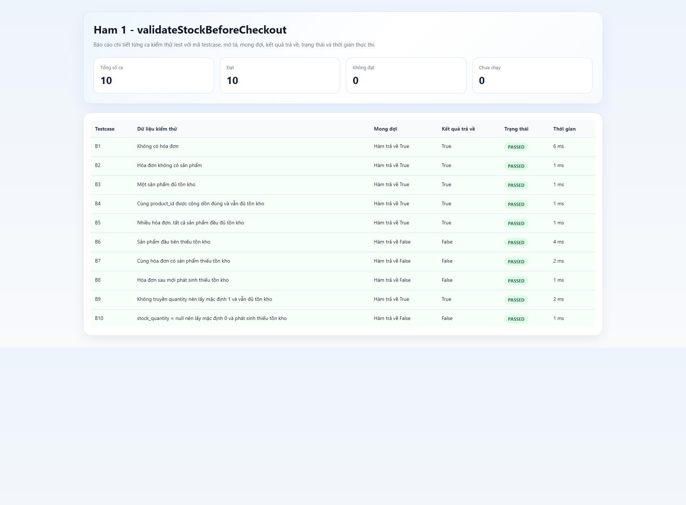
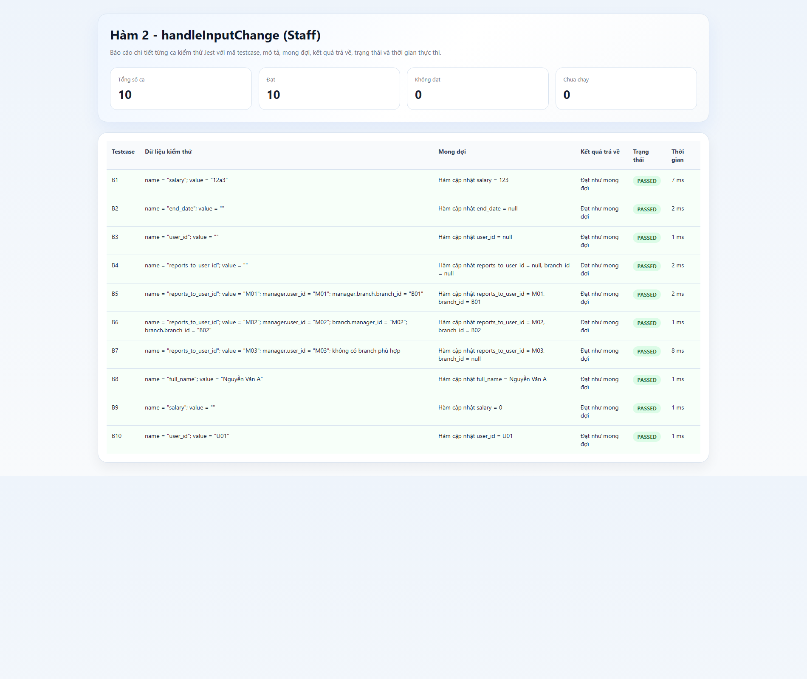
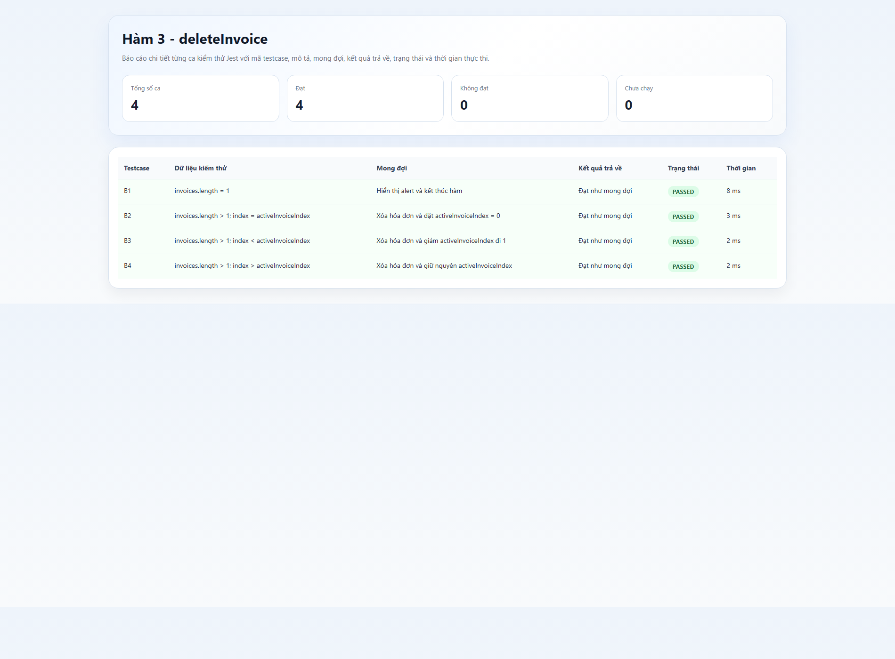
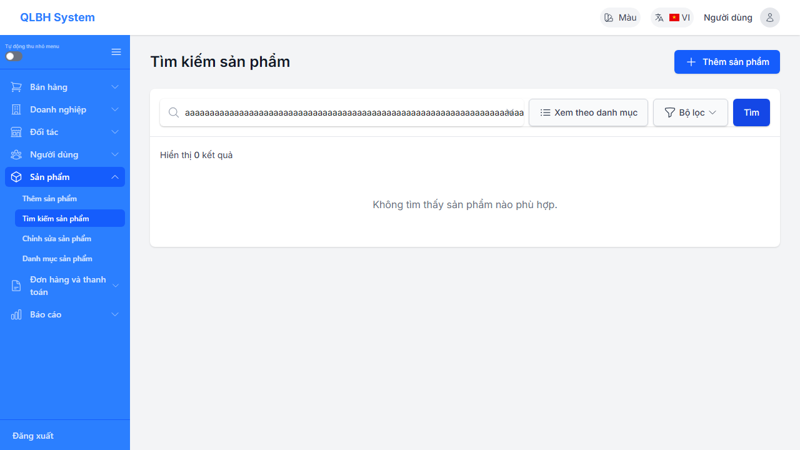
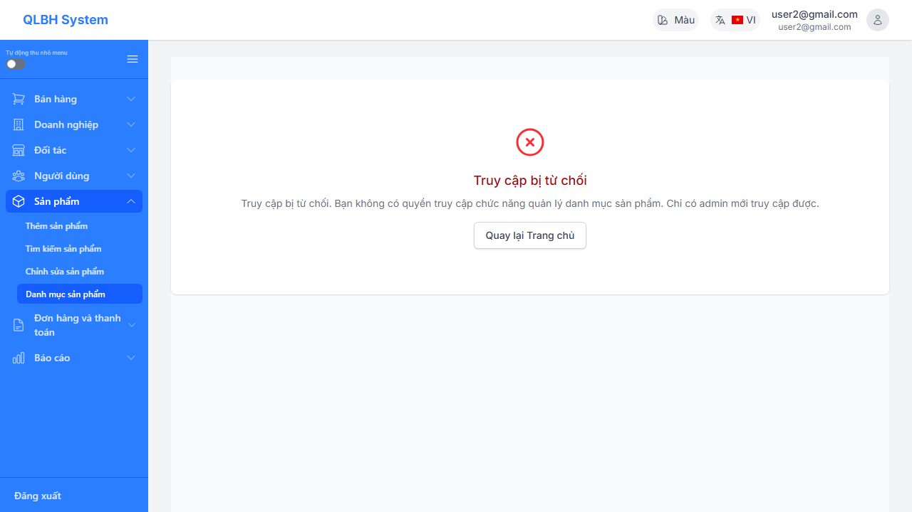
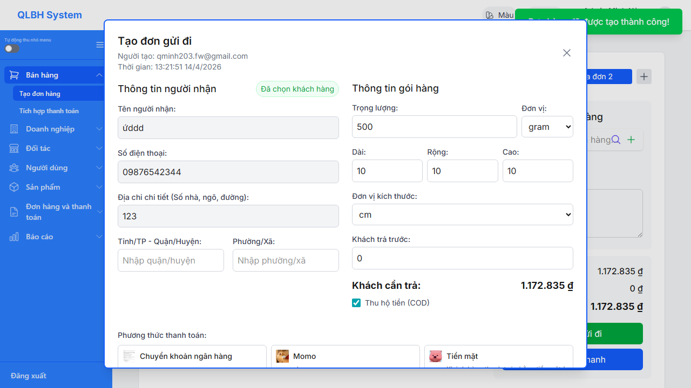

# BAO CAO TONG HOP KIEM THU TU DONG

## 1. Tong quan

Tai lieu nay tong hop toan bo ket qua kiem thu tu dong da thuc hien trong nhom, bao gom:

- Kiem thu don vi bang `Jest`
- Kiem thu hop den tu dong bang `Playwright`
- Ma nguon 9 ham duoc su dung trong phan kiem thu hop trang

Muc tieu cua file nay la giup thanh vien trong nhom mo truc tiep tren GitHub va xem nhanh:

- pham vi kiem thu
- ket qua thuc thi
- anh minh chung
- duong dan toi report va artifact

## 2. Moi truong va cong cu

| Noi dung | Gia tri |
|---|---|
| Kiem thu don vi | Jest |
| Kiem thu hop den tu dong | Playwright + Chromium |
| Moi truong giao dien de test | `https://qlkh-tkhttt.vercel.app/` |
| Noi dung luu tru | Report HTML, JSON, screenshot, video, trace |

## 3. Tong hop ket qua

| Nhom kiem thu | So ca dat / Tong so ca | Ket qua |
|---|---:|---|
| Ham 1 - `validateStockBeforeCheckout()` | 10 / 10 | Dat |
| Ham 2 - `handleInputChange()` | 10 / 10 | Dat |
| Ham 3 - `deleteInvoice()` | 4 / 4 | Dat |
| Gia tri bien - Tim kiem san pham | 7 / 7 | Dat |
| Bang quyet dinh - Dang nhap | 7 / 7 | Dat |
| Use case - Ban hang | 11 / 11 | Dat |

## 4. Kiem thu don vi bang Jest

### 4.1. Ham 1 - `validateStockBeforeCheckout()`

- So ca kiem thu dat: `10/10`
- Coverage:
  - `Statements: 100%`
  - `Branches: 100%`
  - `Functions: 100%`
  - `Lines: 100%`

Minh chung:

- [Ket qua Jest](./TEST_1/Ham_1/jest-reports/stock-validation-results.html)
- [Coverage report](./TEST_1/Ham_1/coverage/lcov-report/index.html)
- [Anh ket qua](./TEST_1/Ham_1/jest-reports/stock-validation-results.png)

### 4.2. Ham 2 - `handleInputChange()`

- So ca kiem thu dat: `10/10`
- Coverage:
  - `Statements: 100%`
  - `Branches: 100%`
  - `Functions: 100%`
  - `Lines: 100%`

Minh chung:

- [Ket qua Jest](./TEST_1/Ham_2/jest-reports/staff-handle-input-change-results.html)
- [Coverage report](./TEST_1/Ham_2/coverage/lcov-report/index.html)
- [Anh ket qua](./TEST_1/Ham_2/jest-reports/staff-handle-input-change-results.png)

### 4.3. Ham 3 - `deleteInvoice()`

- So ca kiem thu dat: `4/4`
- Coverage:
  - `Statements: 100%`
  - `Branches: 100%`
  - `Functions: 100%`
  - `Lines: 100%`

Minh chung:

- [Ket qua Jest](./TEST_1/Ham_3/jest-reports/delete-invoice-results.html)
- [Coverage report](./TEST_1/Ham_3/coverage/lcov-report/index.html)
- [Anh ket qua](./TEST_1/Ham_3/jest-reports/delete-invoice-results.png)

## 5. Ma nguon 9 ham kiem thu hop trang

Thu muc sau tong hop lai 9 ham da duoc nhom chon de phan tich va thiet ke kiem thu hop trang. File trong thu muc nay mo truc tiep tren GitHub se hien thi duoc ngay duoi dang Markdown, phu hop de chia se nhanh cho thanh vien trong nhom.

- [Ma nguon 9 ham kiem thu hop trang](./MA_NGUON_HOP_TRANG_9_HAM/9_ham_kiem_thu_hop_trang.md)

## 6. Kiem thu hop den tu dong bang Playwright

### 5.1. Kiem thu gia tri bien - Tim kiem san pham

- So ca kiem thu dat: `7/7`
- Ky thuat: Kiem thu gia tri bien
- Chuc nang: Tim kiem san pham trong module quan ly san pham

Minh chung:

- [Bao cao tong hop](./Tu_dong_hop_den/bien_timkiem/bao-cao-thuc-thi.html)
- [Playwright report](./Tu_dong_hop_den/bien_timkiem/playwright-report/index.html)
- [Video va trace](./Tu_dong_hop_den/bien_timkiem/test-results/)

### 5.2. Kiem thu bang quyet dinh - Dang nhap

- So ca kiem thu dat: `7/7`
- Ky thuat: Bang quyet dinh
- Chuc nang: Dang nhap he thong

Ghi chu:

- Ca `R6` duoc thuc hien tren tai khoan dang o trang thai `locked`
- Ca `R7` ghi nhan theo hanh vi thuc te cua moi truong deploy, trong do tai khoan `inactive` van bi tu choi dang nhap bang thong bao loi chung

Minh chung:

- [Bao cao tong hop](./Tu_dong_hop_den/bang_quyet_dinh_dang_nhap/bao-cao-thuc-thi.html)
- [Playwright report](./Tu_dong_hop_den/bang_quyet_dinh_dang_nhap/playwright-report/index.html)
- [Video va trace](./Tu_dong_hop_den/bang_quyet_dinh_dang_nhap/test-results/)

### 5.3. Kiem thu use case - Ban hang

- So ca kiem thu dat: `11/11`
- Ky thuat: Kiem thu theo use case
- Chuc nang: Ban hang

Ghi chu:

- He thong cho phep tao nhieu tab hoa don
- Trong hanh vi thuc te hien tai, thao tac luu ap dung cho tab dang duoc chon
- Sau khi luu, tab con lai van giu du lieu de tiep tuc xu ly

Minh chung:

- [Bao cao tong hop](./Tu_dong_hop_den/usecase_ban_hang/bao-cao-thuc-thi.html)
- [Playwright report](./Tu_dong_hop_den/usecase_ban_hang/playwright-report/index.html)
- [Video va trace](./Tu_dong_hop_den/usecase_ban_hang/test-results/)

## 6. Nhan xet chung

Ket qua tong hop cho thay cac bo kiem thu tu dong da duoc xay dung va thuc thi thanh cong cho ca hai huong:

- kiem thu don vi bang `Jest`
- kiem thu hop den tu dong bang `Playwright`

Tat ca cac bo kiem thu hien tai deu dat ket qua mong doi trong pham vi da chon. Phan minh chung bao gom report, screenshot, video va trace da duoc luu lai day du trong repo nay de phuc vu viec doi chieu, trinh bay va chia se voi cac thanh vien trong nhom.
